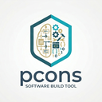

# pcons VS Code Extension

  

VS Code support for projects built with [pcons](https://pcons.org/), a Python-based build system inspired by SCons and CMake.

- [Website](https://pcons.org/)
- [Documentation](https://pcons.readthedocs.io/en/latest/)
- [pcons on GitHub](https://github.com/DarkStarSystems/pcons)

The extension activates automatically when the workspace contains a pcons-build.py file.

## Features

- Generate, build, clean, run, debug, and test pcons targets from VS Code commands.
- Test Explorer integration for discovering, running, and debugging tests.
- Automatic target discovery from generated pcons metadata.
- Status bar controls for build variant, launch target, build targets, and tests.
- CodeLens actions on target definitions inside pcons-build.py:
  - Build
  - Run
  - Debug
  - Optional advanced mode: Run with args, Debug with args
- Build diagnostics surfaced in VS Code Problems.
- Target-specific launch arguments persisted in workspace state.

## Requirements

- pcons installed in the selected Python environment.
- A pcons project with pcons-build.py at workspace root.
- Python available in PATH, or configured via pcons.pythonPath.
- For debugging C/C++ targets:
  - cpptools extension support (debug adapter integration)
  - A debugger (gdb/lldb on Linux/macOS, Visual Studio debugger on Windows)
- For debugging pcons Python commands:
  - A Python debugger extension that provides `type: "python"` launch configurations

## Commands

Main commands:

- pcons: Generate
- pcons: Build
- pcons: Clean
- pcons: Run
- pcons: Debug
- pcons: Test

Selection commands:

- pcons: Select Launch Target
- pcons: Select Build Targets
- pcons: Select Build Variant
- pcons: Select Test Targets

Advanced commands:

- pcons: Debug Generate
- pcons: Set Executable Arguments
- pcons: Debug With Arguments
- pcons: Debug pcons Command
- pcons: Build Target
- pcons: Run Target
- pcons: Debug Target
- pcons: Toggle Advanced CodeLens Mode
- pcons: Clear Diagnostics

## Keybindings

When in a pcons workspace:

- F7: Build
- Ctrl+Shift+F7: Debug Generate
- Ctrl+F7: Clean
- F5: Debug
- Ctrl+F5: Debug With Arguments
- Shift+F5: Run
- Ctrl+Shift+F5: Debug pcons Command
- Ctrl+Alt+A: Toggle Advanced CodeLens Mode

## Extension Settings

The extension contributes the following settings:

- pcons.buildFolder (string, default: build)
  - Build directory path.
  - Supports ${workspaceFolder} and ${variant} placeholders.
- pcons.pythonPath (string, default: python)
  - Python executable setting exposed by the extension.
- pcons.debuggerPath (string, default: null)
  - Debugger executable path (for example gdb or lldb-mi).
- pcons.jobs (integer)
  - Maximum parallel jobs for build/test commands.
- pcons.pythonDebugJustMyCode (boolean, default: true)
  - Controls JustMyCode when debugging pcons python commands.
- pcons.variants (array, default: ["debug", "release"])
  - Variants available for this project. The first one will be used as default.
- pcons.variables (object, default: {})
  - Workspace build variables forwarded to generate.

## Workflow

1. Open a project containing pcons-build.py.

- The extension activates and automatically runs generate to discover targets.

2. Select build/launch/test targets from the status bar if needed.
2. Build, run, debug, or test from commands, keybindings, CodeLens, or Test Explorer.

## Development

Useful scripts:

- npm run compile: type-check, lint, and bundle to dist/extension.js
- npm run watch: start TypeScript and esbuild watchers
- npm run test: run extension tests
